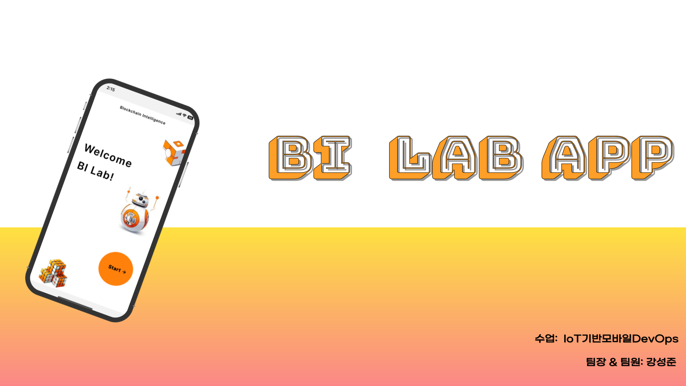
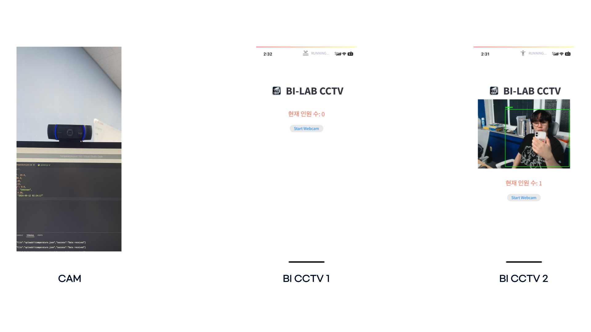
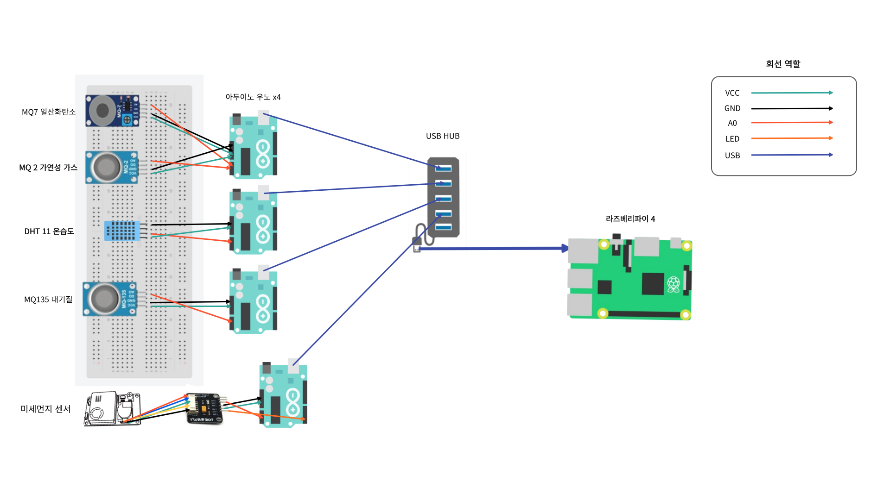

# BI LAB App
---------------------------------------------------------------------------

# ✅ Topic
### 연구실에 수집된 온도, 습도, 미세먼지, 대기센서 정보 바탕으로  랭체인 기반 IoT 비서 챗봇 시스템을 제공합니다.

# 🔬 서비스 기능
#### 🤠 BIVIS ChatBot
    - BIVIS 챗봇은 연구실에 대한 정보와 실시간 IoT 정보를 제공합니다. 
#### 📊 IoT Graph
    - IoT Graph 서비스는 1시간 동안 수집된 IoT 센서 값을 그래프로 보여줍니다.  
#### 📸 BI CCTV 
    - BI CCTV 서비스는 YOLO V4 Tiny 모델을 사용하여 사람을 대상으로 객체 인식을 진행하여 현재 연구원이 몇명인지 알려줍니다.
#### 👨‍👨‍👧‍👧 Member
    - BI 연구원 멤버 소개

## UI / UX

## 🤠 BIVIS ChatBot

## 📊 IoT Graph

## 📸 BI CCTV 

---------------------------------------------------------------------------
### 🌠 아두이노 및 라즈베리파이 구성도

---------------------------------------------------------------------------
### 🧫 센서 서버 아키텍처

---------------------------------------------------------------------------
### 🤖 챗봇 서버 아키텍처

---------------------------------------------------------------------------
### 📈 IoT Graph Express 

---------------------------------------------------------------------------
### 🔍 CCTV 아키텍처
